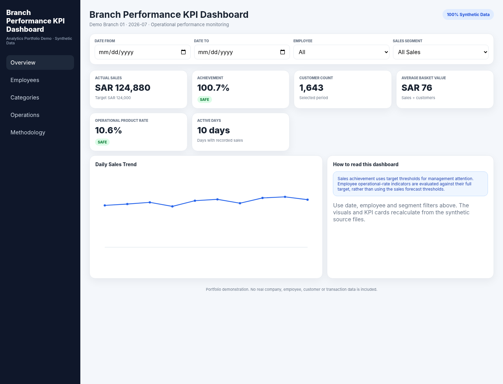
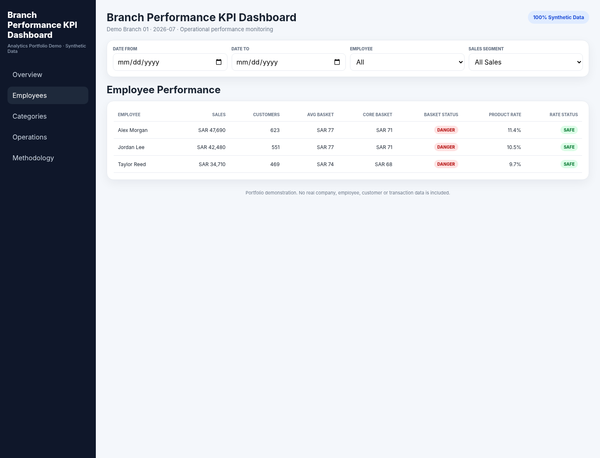

# Branch Performance KPI Dashboard

A recruiter-friendly **Data Analyst / Business Analyst portfolio project** that demonstrates how a retail branch can monitor sales, customers, employee performance, product/category performance, operational targets, reminders, upcoming activities, trends, and performance status in one interactive dashboard.

> **Privacy note:** every record, employee name, branch name, target, category value, and operational event in this repository is synthetic. The public version deliberately uses generalized business terminology and does not contain confidential company information or proprietary datasets.

## Featured Portfolio

**Khaled Zidan — Healthcare & Business Data Analytics**

[Saudi Healthcare Analytics](https://github.com/khaledzidan203-stack/saudi-healthcare-analytics) ·
[Hospital360](https://github.com/khaledzidan203-stack/Hospital360) ·
[Online Retail Growth & Customer Intelligence](https://github.com/khaledzidan203-stack/online-retail-growth-customer-intelligence) ·
[Pharmacy Category Management](https://github.com/khaledzidan203-stack/pharmacy-category-management) ·
[Regional Sales Performance](https://github.com/khaledzidan203-stack/regional-sales-analytics-portfolio)

**Core stack:** Power BI · SQL · Python · DAX · Analytics Engineering · Healthcare / Pharmacy / Retail Analytics

## Executive summary

The project converts branch-level operational data into an interactive management view. Users can filter by date, employee, and sales segment, while KPI cards, employee metrics, and trend visuals recalculate from the underlying sample CSV/JSON files.

The repository is intentionally lightweight: the dashboard is built with HTML, CSS, and vanilla JavaScript, so reviewers can inspect the analytical logic directly without a complex framework.

## Business problem

Retail branch managers often need to answer several questions at the same time: Are sales on target? Is customer traffic supporting the result? Is average basket value healthy? Which employee or category is underperforming? Which operational metrics require immediate intervention? What activities and reminders are coming next?

When these measures are spread across spreadsheets and manual reports, performance reviews become slow and inconsistent. This project demonstrates a compact KPI-management approach that puts target achievement, trend analysis, employee performance, category performance, and operational follow-up into one interface.

## Project objectives

- Monitor actual sales against a defined branch sales target.
- Calculate achievement percentage and management status.
- Track customer count and Average Basket Value.
- Compare employee sales, customer, basket, and operational-rate metrics.
- Analyze product/category sales against targets.
- Surface upcoming activities and recurring reminders.
- Support date, employee, and sales-segment filtering.
- Demonstrate transparent KPI calculations that can be audited in source code.

## Dataset description

The public dataset is synthetic and intentionally small enough to understand quickly.

| File | Purpose |
|---|---|
| `data/sample/daily_sales.csv` | Daily employee-level sales, customer counts, and generalized channel inputs |
| `data/sample/category_sales.csv` | Category actual sales and targets |
| `data/sample/config.json` | Demo branch, month, KPI targets, and status thresholds |
| `data/sample/activities.json` | Upcoming operational activities |
| `data/sample/reminders.json` | Operational reminders |

The sample data represents a fictional retail branch with three fictional employees. It is not derived from a real customer, company, branch, pharmacy, prescription, employee, or proprietary source.

## Tools and technologies

- HTML5
- CSS3
- Vanilla JavaScript (ES6+)
- CSV and JSON as portable analytical data sources
- SVG for lightweight trend visualization
- Optional SQL reference scripts for demonstrating relational modeling
- Power BI mapping documentation for showing how the same model can be implemented in BI tooling
- Git / GitHub for version control and portfolio delivery

No build tool, framework, database, API key, credential, or paid dependency is required to run the web dashboard.

## Data preparation

The dashboard follows a simple analytical pipeline:

1. Load synthetic CSV and JSON source files.
2. Parse daily employee-level records.
3. Convert numeric fields to analytical values.
4. Derive core/special segment values from generalized channel inputs.
5. Calculate customer and basket metrics.
6. Aggregate by selected period, employee, and segment.
7. Apply target and status rules.
8. Render KPI cards, tables, category bars, trend visuals, activities, and reminders.

See `docs/DATA_PREPARATION.md` for the detailed flow.

## Data model

The browser implementation uses a lightweight dimensional concept:

- **FactDailySales** — date × employee observations.
- **DimEmployee** — employee identifier and display name.
- **DimDate** — date and period context.
- **FactCategoryPerformance** — category actual and target values.
- **OperationalActivities** — dated branch actions.
- **Reminders** — recurring operational follow-up items.
- **Config / Targets** — branch-level target settings and status thresholds.

See `docs/DATA_MODEL.md` and `sql/schema.sql`.

## KPIs

Core KPIs demonstrated in the public version include:

| KPI | Calculation |
|---|---|
| Sales Target | Configured target adjusted to the selected calendar period |
| Actual Sales | Sum of sales in the selected view |
| Achievement % | Actual Sales / Period Sales Target |
| Customer Count | Sum of customer transactions in the selected view |
| Average Basket Value | Actual Sales / Customer Count |
| Core Retail Basket | Core Retail Sales / Core Retail Customers |
| Operational Product Rate | Selected operational-product sales / Core Retail Sales |
| Category Achievement | Category Sales / Category Target |
| Active Days | Distinct days with recorded sales |

Sales management status is generalized as **SAFE ≥ 85%**, **WATCH = 80%–84.99%**, and **DANGER < 80%**. Operational-rate indicators use a separate point-in-time rule: the configured rate target must be fully achieved to be SAFE.

Full definitions and assumptions are in `KPI_DEFINITIONS.md`.

## Analytical methodology

The project emphasizes four analytical ideas:

**Target variance analysis.** Actual sales are compared with period-adjusted targets to show how far performance is from plan.

**Driver analysis.** Customer Count and Average Basket Value separate volume from value-per-customer behavior, helping a reviewer understand *why* sales changed.

**Employee performance analysis.** Employee-level sales, customers, basket values, and operational rates are calculated from transaction aggregates rather than assigned portions of the branch sales target.

**Category and operational analysis.** Product/category performance is measured against category targets, while upcoming activities and reminders connect analysis to operational action.

## Dashboard / report structure

- **Overview** — KPI cards, achievement status, active days, and daily trend.
- **Employees** — employee-level performance table and status metrics.
- **Categories** — category target achievement comparison.
- **Operations** — upcoming activities and reminders.
- **Methodology** — concise definitions and calculation notes inside the application.

Global filters for date, employee, and sales segment remain visible above the dashboard pages.

## Key insights demonstrated by the project

The repository demonstrates *how* an analyst can identify insights rather than claiming any real-world business result. With the included synthetic data, a reviewer can observe examples such as:

- whether selected-period sales are above or below the management threshold;
- whether a change in sales is associated with customer count or basket value;
- which fictional employee has the strongest basket or operational rate;
- which synthetic product category is closest to or furthest from its target;
- how the same measures change when filtering to a specific employee, date range, or segment.

These are demonstrable behaviors of the included sample data—not claims about any real company.

## Screenshots





## Repository structure

```text
branch-performance-kpi-dashboard/
├── README.md
├── LICENSE
├── .gitignore
├── CHANGELOG.md
├── CONTRIBUTING.md
├── KPI_DEFINITIONS.md
├── DATA_DICTIONARY.md
├── BUSINESS_LOGIC.md
├── PORTFOLIO_NOTES.md
├── index.html
├── css/
│   └── styles.css
├── js/
│   └── app.js
├── data/
│   └── sample/
│       ├── daily_sales.csv
│       ├── category_sales.csv
│       ├── config.json
│       ├── activities.json
│       └── reminders.json
├── screenshots/
│   ├── dashboard-overview.png
│   └── employee-performance.png
├── docs/
│   ├── ARCHITECTURE.md
│   ├── BUSINESS_REQUIREMENTS.md
│   ├── DATA_MODEL.md
│   ├── DATA_PREPARATION.md
│   ├── INSTALLATION.md
│   ├── USAGE.md
│   ├── POWER_BI_MAPPING.md
│   ├── PRIVACY_AND_SYNTHETIC_DATA.md
│   └── TESTING.md
├── sql/
│   ├── schema.sql
│   └── analysis_queries.sql
└── examples/
    └── example_output.md
```

## Installation / setup

Because the application reads local CSV/JSON files, run it through a simple local web server.

### Option 1 — Python

```bash
python -m http.server 8000
```

Then open `http://localhost:8000`.

### Option 2 — VS Code Live Server

Open the repository in VS Code and use the Live Server extension on `index.html`.

There is no `requirements.txt` or `package.json` because the dashboard has **zero runtime package dependencies**.

## How to use

1. Open the dashboard through a local server.
2. Review the Overview KPI cards.
3. Change **Date From / Date To** to test period analysis.
4. Choose a fictional employee to isolate individual performance.
5. Choose **Core Retail** or **Special Channel** to compare generalized sales segments.
6. Open Employees to review employee-level KPIs.
7. Open Categories to compare category target achievement.
8. Open Operations to see planned activities and reminders.
9. Inspect `js/app.js` to review the analytical calculations.

## Design choices

- **Vanilla JavaScript** keeps the analytical logic visible to recruiters.
- **CSV/JSON** makes the data easy to inspect and replace.
- **No external chart library** keeps the demo dependency-free.
- **Separate sales and operational status logic** avoids treating all KPIs as if they had the same threshold behavior.
- **Generalized segment names** demonstrate the analytical design without exposing internal business terminology.
- **Synthetic data by design** makes the repository safe for a public portfolio.

## Skills demonstrated

- Business requirements translation
- KPI definition and governance
- Data cleaning and transformation logic
- Dimensional/data-model thinking
- Aggregation and period filtering
- Target vs actual analysis
- Customer and basket analysis
- Employee performance analysis
- Product/category analysis
- Trend analysis
- Dashboard UX and information hierarchy
- JavaScript-based analytics
- SQL modeling concepts
- Power BI model translation
- Documentation and stakeholder communication
- Data privacy and portfolio-safe anonymization

## Future improvements

- Add year/month selectors and multiple synthetic periods.
- Add forecast scenarios with explicit data-completeness controls.
- Add CSV upload for user-provided demo data.
- Add automated unit tests for KPI boundary conditions.
- Add richer category drill-through and waterfall variance analysis.
- Add a Power BI `.pbix` implementation using the documented data model.
- Add GitHub Pages deployment workflow.

## License

MIT License. See `LICENSE`.
